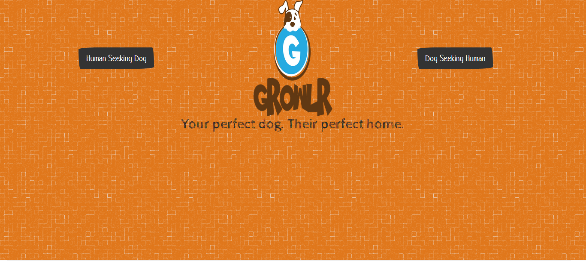
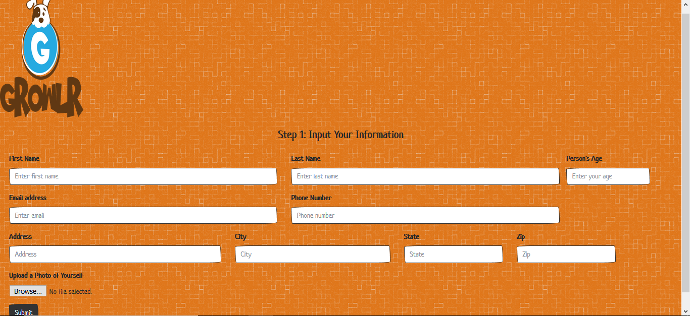
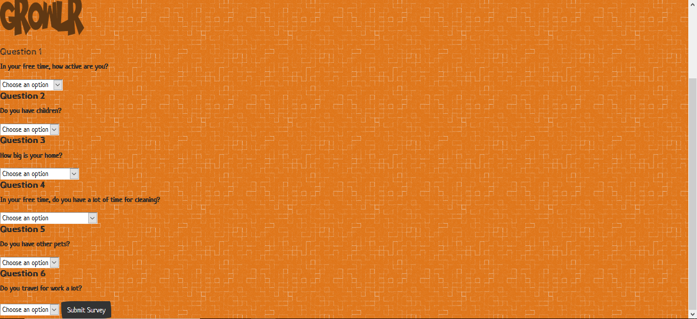
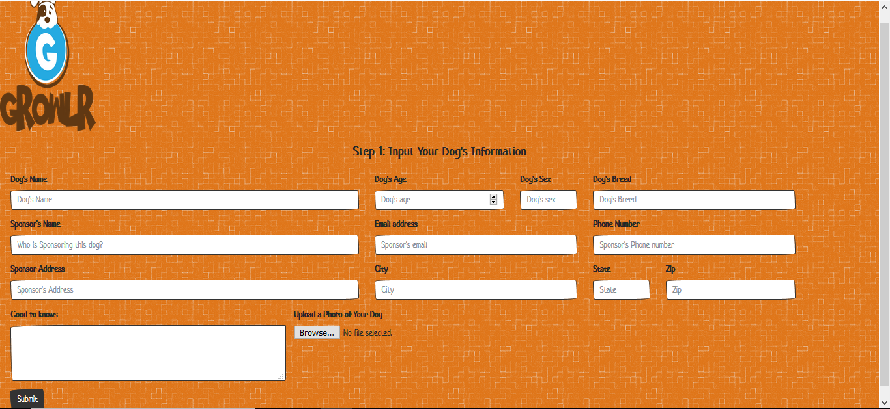

# Growlr

An application which helps people to find dogs as pets and dogs to find people as owners based on measures of compatibility via a survey.

## How to Use

User opens application via the Heroku [link](https://warm-sierra-75928.herokuapp.com/) to the homepage.

If the user is a person, he or she clicks the button "Human Looking For Dog". A form opens up, where they provide their basic information (name, address, email, age, etc) along with a photograph of themselves, and following this is a survey where they provide answers to questions and statements using drop-down choices. Upon completing the survey, the user clicks "Submit" and is shown the dog with whom he or she has the most compatibility based on the answers which were given.

If the user is a person or company (animal shelter, PetSmart, etc.) acting on behalf of a dog - known as a "Sponsor" - he or she clicks the button "Dog Looking For Human". In the following form page, the sponsor provides the dog's basic information (name, breed, age, etc) as well as their own information (peronal or company name, address, phone number, etc.) and a photo of the dog. Following this is a survey where they provide answers to questions and statements about the dog using drop-down choices. Upon completing the survey, the user clicks "Submit" and is shown the person with whom the dog has the most compatibility based on the answers which were given.

App also contains a link to the JSON data, which contains an array of people ("friends") and their scores, which are compared against data from the user to determine compatibility.

### Prerequisites

npm [express](https://www.npmjs.com/package/express)

npm [path](https://www.npmjs.com/package/path)

npm [bodyParser](https://www.npmjs.com/package/body-parser)

npm [mysql](https://www.npmjs.com/package/mysql)

### Technologies Used

HTML5, CSS4, Boostrap, Javascript, Node.js, MySQL, NPM, Handlebars, MVC, API Routes

Text Editor - VS Studio

## Preview

### Homepage
- - - -

### Person Information Page
- - - -

### Person Survey
- - - -

### Dog Information Page
- - - -

## Contributing

Please feel free to branch off with tweaks and making a repo; open to suggestions!

## Future Development

* Creating a proper table.
* Allow user to add multiple items to a single transaction.
* Creating similar and connected apps for managers and supervisors.

## Authors

* **Wesley Hutchins** - [Github](https://github.com/WesPres1990)
* **Johnathan Brown** - [GitHub](https://github.com/JonathanBrownCFA)
* **Cynthia Sidlaukas** - [GitHub](https://github.com/cynthiasidlauskas)
* **Nathan Young** - [GitHub](https://github.com/21ghosts)